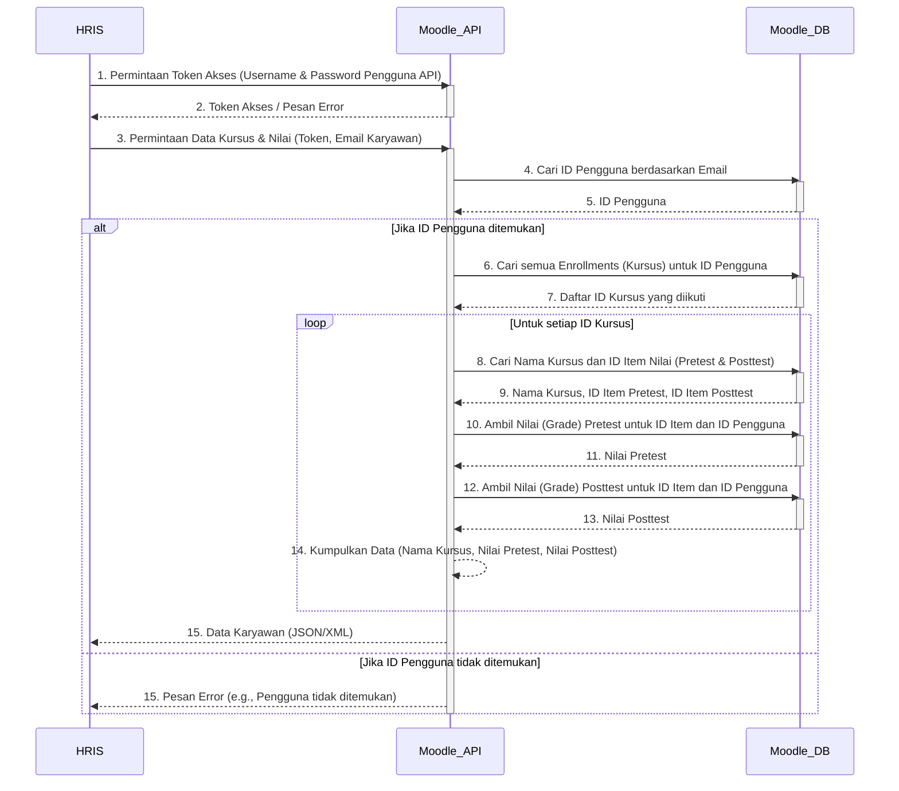

## DRAFT API HRIS LMS
API untuk integrasi dengan HRIS

```mermaid
sequenceDiagram
    participant HRIS
    participant Moodle_API
    participant Moodle_DB
    
    HRIS->>Moodle_API: 1. Permintaan Token Akses (Username & Password Pengguna API)
    activate Moodle_API
    Moodle_API-->>HRIS: 2. Token Akses / Pesan Error
    deactivate Moodle_API
    
    HRIS->>Moodle_API: 3. Permintaan Data Kursus & Nilai (Token, Email Karyawan)
    activate Moodle_API
    
    Moodle_API->>Moodle_DB: 4. Cari ID Pengguna berdasarkan Email
    activate Moodle_DB
    Moodle_DB-->>Moodle_API: 5. ID Pengguna
    deactivate Moodle_DB
    
    alt Jika ID Pengguna ditemukan
        Moodle_API->>Moodle_DB: 6. Cari semua Enrollments (Kursus) untuk ID Pengguna
        activate Moodle_DB
        Moodle_DB-->>Moodle_API: 7. Daftar ID Kursus yang diikuti
        deactivate Moodle_DB
        
        loop Untuk setiap ID Kursus
            Moodle_API->>Moodle_DB: 8. Cari Nama Kursus dan ID Item Nilai (Pretest & Posttest)
            activate Moodle_DB
            Moodle_DB-->>Moodle_API: 9. Nama Kursus, ID Item Pretest, ID Item Posttest
            deactivate Moodle_DB
            
            Moodle_API->>Moodle_DB: 10. Ambil Nilai (Grade) Pretest untuk ID Item dan ID Pengguna
            activate Moodle_DB
            Moodle_DB-->>Moodle_API: 11. Nilai Pretest
            deactivate Moodle_DB
            
            Moodle_API->>Moodle_DB: 12. Ambil Nilai (Grade) Posttest untuk ID Item dan ID Pengguna
            activate Moodle_DB
            Moodle_DB-->>Moodle_API: 13. Nilai Posttest
            deactivate Moodle_DB
            
            Moodle_API-->>Moodle_API: 14. Kumpulkan Data (Nama Kursus, Nilai Pretest, Nilai Posttest)
        end
        
        Moodle_API-->>HRIS: 15. Data Karyawan (JSON/XML)
    else Jika ID Pengguna tidak ditemukan
        Moodle_API-->>HRIS: 15. Pesan Error (e.g., Pengguna tidak ditemukan)
    end
    
    deactivate Moodle_API
```